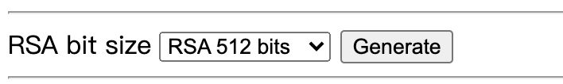
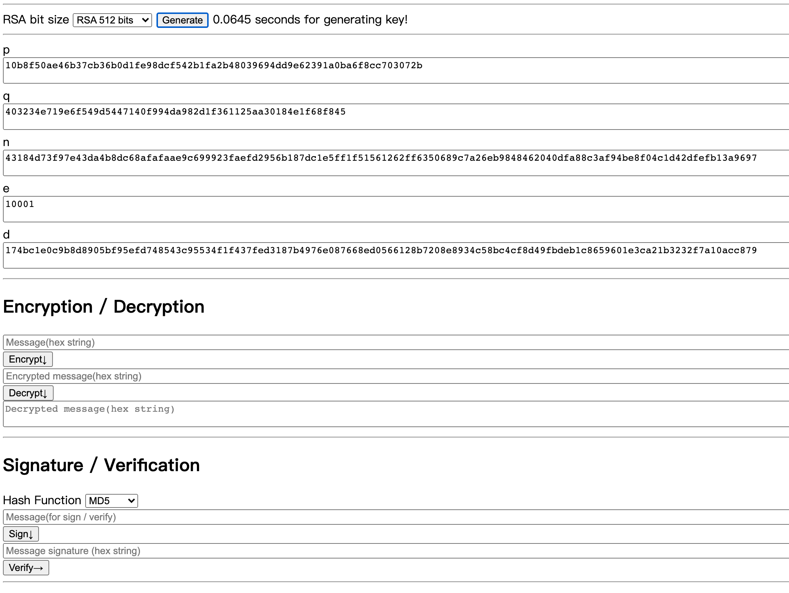
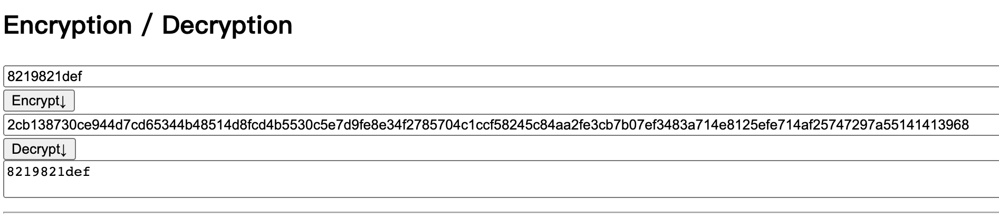
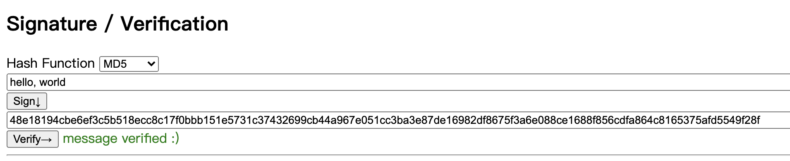

# simple-rsa
一个简单高效的使用python实现的RSA加密/解密/签名/验证算法库。

# 程序运行要求
- python >= **3.8** (请使用>=3.8版本的python，该项目使用了3.8的新版特性)
- flask

因为是用python写的，源代码和可执行文件是一样的，没有区分`src`文件和`bin`文件夹。

# 运行过程

## 命令行测试公钥对生成

用法：`python lib.py --nbits n`	就可以生成公钥对并测量消耗时间。

本机测试结果为：

| n的比特数 | 运行时间(s) |
| --------- | ----------- |
| 256       | 0.01        |
| 512       | 0.06        |
| 1024      | 0.5         |
| 2048      | 6.0         |

可以看到，算法满足要求（1024比特公钥对所需时间小于1s）

## 图形界面测试完整功能

直接`python main.py`就可以运行程序，程序会监听8080端口，点击 [http://0.0.0.0:8080/](http://0.0.0.0:8080/)就可以看到基于网页的图形界面。

### 公钥对生成

初始时，界面上只有生成公钥对的选项。点击生成后，才会出来完整的界面。生成的公钥对用于下方的其他功能。

### 完整界面

完整界面分为三块区域，顶部是显示秘钥对的各种参数（数字均用十六进制字符串表示），中间区域是加密解密区域，底部是消息签名、验证区域，操作都很直观。

### 加密解密

下图是一份操作示例：

### 签名验证

# 实现细节说明

本实现中利用了新版python的诸多特性，所以能够比较快速地生成公钥对。其它方面并无亮点。

# 收获

我曾经尝试了两种并行方法来寻找质数，希望进一步加快程序运行速度。

1. 将一个大区间等分成四份，四份并行寻找质数。结果发现并没有多大提升，这可能是因为质数在整数区间里的分布比较均匀，在[$2^n$, $2*2^n$]找质数和在[$2*2^n$, $3*2^n$]找质数的速度差不多。
2. 一次性进行多个质数测试。我寻找的是$6n+1$类型的质数，然后尝试着用多进程一次性判断$6n+1$, $6n+7$, $6n+13$, $6n+19$，最后发现也没有提升，反而变慢了。我怀疑是因为[Miller-Rabin](https://en.wikipedia.org/wiki/Miller–Rabin_primality_test)检测比较高效，导致进程间通信成为瓶颈。

所以，理论上可行的方法，实际中不一定有用，还是需要用实践来检验。

